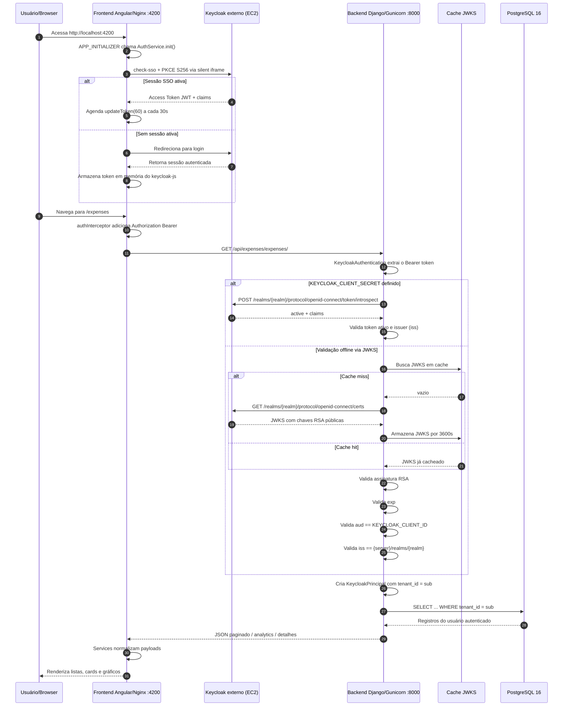

# 💸 Financial System

Sistema financeiro pessoal com frontend Angular, backend Django REST e autenticação centralizada no Keycloak.

## 📌 O que é o sistema

Este projeto foi feito para organizar finanças pessoais do dia a dia em uma única aplicação:

- gastos recorrentes e pontuais;
- compras parceladas;
- cartões de crédito;
- categorias customizadas;
- compras de supermercado com itens;
- analytics financeiros;
- controle de dívidas com a Vitória.

A proposta é simples: ter um sistema próprio, com isolamento por usuário, autenticação segura e uma UI rápida para consultar meses anteriores mesmo depois de meses sem tocar no projeto.

---

## 🏗️ Arquitetura geral

O ecossistema tem **4 peças principais**:

1. **Frontend** (`frontend/`)
   - Angular 17
   - roda em container Nginx
   - exposto em `http://localhost:4200`

2. **Backend API** (`backend/`)
   - Django + DRF + Gunicorn
   - exposto em `http://localhost:8000`

3. **Banco de dados**
   - PostgreSQL 16 (`postgres:16-alpine`)
   - usado somente na rede interna Docker

4. **Keycloak externo**
   - hospedado fora do `docker-compose`
   - URL atual: `https://ec2-54-147-150-5.compute-1.amazonaws.com`

### Como eles conversam

- o browser acessa o frontend;
- o frontend autentica no Keycloak com `keycloak-js`;
- o frontend envia Bearer token para o backend;
- o backend valida JWT via JWKS ou introspection;
- o backend consulta o PostgreSQL filtrando sempre por `tenant_id`.

---

## 🔄 Diagrama Mermaid completo



---

## 🚀 Como subir o projeto

```bash
# Clone
git clone <url-do-repositorio>
cd Financial-System

# Configure as envs
cp backend/.env.example backend/.env
# edite backend/.env com suas configs

# Suba tudo
docker compose up --build
```

Depois disso:

- frontend: `http://localhost:4200`
- backend: `http://localhost:8000`

---

## 🔌 Serviços e portas

| Serviço | URL local | Tecnologia |
|---|---|---|
| Frontend | http://localhost:4200 | Angular + Nginx |
| Backend API | http://localhost:8000 | Django + Gunicorn |
| Banco de dados | (interno) | PostgreSQL 16 |
| Keycloak | https://ec2-54-147-150-5.compute-1.amazonaws.com | Keycloak (EC2 externo) |

---

## 🔧 Variáveis de ambiente críticas

Antes de rodar, o mínimo que precisa estar correto:

| Variável | Onde | Obrigatória? | Observação |
|---|---|---|---|
| `SECRET_KEY` | backend `.env` | Sim | Gere uma chave forte |
| `DEBUG` | backend `.env` | Sim | Em produção, mantenha `False` |
| `ALLOWED_HOSTS` | backend `.env` | Sim | Liste hosts reais |
| `DB_NAME` | backend `.env` | Sim | Nome do banco |
| `DB_USERNAME` | backend `.env` | Sim | Usuário do Postgres |
| `DB_PASSWORD` | backend `.env` | Sim | Senha forte |
| `DB_HOST` | backend `.env` | Sim | Em Docker Compose local: `db` |
| `DB_PORT` | backend `.env` | Sim | Normalmente `5432` |
| `DB_SSL_MODE` | backend `.env` | Sim | `disable` no Compose local, `require` em produção |
| `KEYCLOAK_SERVER_URL` | backend `.env` + compose | Sim | URL do Keycloak |
| `KEYCLOAK_REALM` | backend `.env` + compose | Sim | Realm correto |
| `KEYCLOAK_CLIENT_ID` | backend `.env` + compose | Sim | Cliente aceito no `aud` |
| `KEYCLOAK_CLIENT_SECRET` | backend `.env` | Depende | Necessário se o backend usar introspection |
| `KEYCLOAK_VERIFY_SSL` | backend `.env` | Sim | `True` fora de dev sem TLS local |
| `KEYCLOAK_VERIFY_AUDIENCE` | backend `.env` | Sim | Idealmente sempre `True` |
| `CORS_ALLOWED_ORIGINS` | backend `.env` | Sim | Ex.: `http://localhost:4200` |
| `apiBaseUrl` | frontend `environment.ts` | Sim | Base da API consumida pelo Angular |
| `keycloak.url` | frontend `environment.ts` | Sim | URL do provedor OIDC |
| `keycloak.realm` | frontend `environment.ts` | Sim | Realm do SPA |
| `keycloak.clientId` | frontend `environment.ts` | Sim | Cliente público do frontend |

### Exemplo local

```env
SECRET_KEY=change-me
DEBUG=True
ALLOWED_HOSTS=localhost,127.0.0.1
DB_NAME=financial_db
DB_USERNAME=postgres
DB_PASSWORD=postgres
DB_HOST=db
DB_PORT=5432
DB_SSL_MODE=disable
KEYCLOAK_SERVER_URL=https://ec2-54-147-150-5.compute-1.amazonaws.com
KEYCLOAK_REALM=projetos-pessoais
KEYCLOAK_CLIENT_ID=financial-frontend
KEYCLOAK_VERIFY_SSL=True
KEYCLOAK_VERIFY_AUDIENCE=True
CORS_ALLOWED_ORIGINS=http://localhost:4200
```

---

## 🧾 Fluxo de dados de um gasto parcelado

Exemplo: usuário cria uma compra de `R$ 1.200,00` em **6 parcelas**.

### 1. Clique no frontend
Na tela de novo gasto, o usuário informa algo como:

```json
{
  "category_id": 4,
  "description": "Celular",
  "amount": -1200.00,
  "date": "2026-06-17",
  "payment_method": "cartao",
  "credit_card_id": 1,
  "is_installment": true,
  "installments": 6,
  "need_pay_vitoria": false
}
```

### 2. Frontend envia request autenticada

- `ExpenseService.create(payload)` chama:
  - `POST /api/expenses/expenses/create-expense/`
- `authInterceptor` injeta `Authorization: Bearer <token>`.

### 3. Backend autentica e identifica o tenant

- `KeycloakAuthentication` valida o token;
- cria `request.user.tenant_id` a partir da claim `sub`.

### 4. Backend executa a regra de parcelamento

`CreateExpenseBehavior.run()`:

- divide o valor por `installments`;
- percorre de `1` até `N`;
- cria descrições como:
  - `Celular - Parcela 1/6`
  - `Celular - Parcela 2/6`
  - ...
- avança a data mês a mês com `relativedelta(months=1)`.

### 5. Banco recebe N inserções

Resultado esperado no banco:

- **6 registros** na tabela `expenses`;
- todos com o mesmo `tenant_id`;
- valor por parcela = `-200.00`;
- datas distribuídas ao longo dos meses.

### 6. Resposta volta ao frontend

A API retorna uma estrutura com:

- `success`
- `message`
- `is_installment`
- `installments`
- `total_amount`
- `installment_amount`
- lista de parcelas criadas

### 7. Frontend consome depois em múltiplas telas

Esses registros reaparecem em:

- `/expenses`
- `/history`
- `/cards/:id/expenses`
- `/installments`
- `/analytics`

---

## 🧠 Decisões arquiteturais

### Angular no frontend
Porque entrega:

- SPA rápida;
- roteamento robusto;
- integração boa com componentes standalone;
- ecossistema maduro para dashboards e formulários.

### Django + DRF no backend
Porque oferece:

- produtividade alta;
- ORM maduro;
- serializers e viewsets para CRUDs rápidos;
- facilidade para concentrar regra de negócio em behaviors.

### PostgreSQL
Porque é ótimo para:

- consistência transacional;
- agregações de analytics;
- índices compostos (`tenant_id + date`, `tenant_id + card`).

### Keycloak
Porque evita reinventar autenticação:

- OIDC/OAuth2 prontos;
- gerenciamento de sessão;
- JWT assinado;
- suporte a clientes públicos e confidential.

### Docker Compose
Porque simplifica o retorno ao projeto:

- sobe frontend, backend e banco com um comando;
- padroniza o ambiente local;
- reduz drift de configuração.

---

## 🛡️ Segurança

Resumo das proteções implementadas hoje:

### OWASP A01 — Broken Access Control
- filtros por `tenant_id` em todos os querysets principais;
- checks de ownership em `perform_destroy()`;
- validação de FKs em `debts` e `supermarket items`.

### OWASP A02 — Cryptographic Failures
- JWT assinado por RSA;
- opção de conexão SSL com banco;
- `SECRET_KEY` externo por ambiente.

### OWASP A03 — Injection
- uso do ORM do Django em vez de SQL manual;
- busca textual com limite de tamanho.

### OWASP A05 — Security Misconfiguration
- `DEBUG=False` por padrão;
- `ALLOWED_HOSTS` explícito;
- CORS restrito;
- headers de segurança no Django e no Nginx;
- banco sem porta pública exposta por padrão no Compose.

### OWASP A07 — Identification and Authentication Failures
- validação de `exp`, `aud` e `iss`;
- rate limiting de API;
- refresh de token no frontend.

### OWASP A09 — Security Logging and Monitoring Failures
- logging estruturado no backend;
- erros de autenticação sem vazar detalhes internos.

---

## ☁️ Para o EC2 — checklist antes de produção

### Backend / Django
- [ ] gerar `SECRET_KEY` forte
- [ ] garantir `DEBUG=False`
- [ ] configurar `ALLOWED_HOSTS` com domínio real
- [ ] configurar `CORS_ALLOWED_ORIGINS` com domínio do frontend
- [ ] usar `DB_SSL_MODE=require`
- [ ] revisar `KEYCLOAK_CLIENT_ID` e `KEYCLOAK_CLIENT_SECRET`
- [ ] ajustar `GUNICORN_WORKERS` conforme CPU/memória
- [ ] validar HSTS/proxy HTTPS

### Banco
- [ ] usar senha forte
- [ ] manter porta não exposta publicamente
- [ ] habilitar backup/snapshot
- [ ] validar retenção de dados e monitoramento

### Frontend
- [ ] trocar `apiBaseUrl` para URL pública da API
- [ ] confirmar `keycloak.url`, `realm` e `clientId`
- [ ] rebuildar a imagem após mudar `environment.ts`
- [ ] revisar CSP e origens liberadas no Nginx

### Keycloak
- [ ] confirmar redirect URIs do frontend
- [ ] confirmar web origins permitidas
- [ ] decidir se o backend será public client (JWKS) ou confidential (introspection)
- [ ] revisar validade dos tokens e política de refresh

### Observação importante
- [ ] revisar as custom actions de `expenses/create-expense` e `debts/summary`, porque hoje as decorators estão associadas ao `perform_destroy` no código.

---

## 📚 READMEs específicos

- [`backend/README.md`](./backend/README.md)
- [`frontend/README.md`](./frontend/README.md)

Esses dois arquivos detalham cada camada separadamente.
